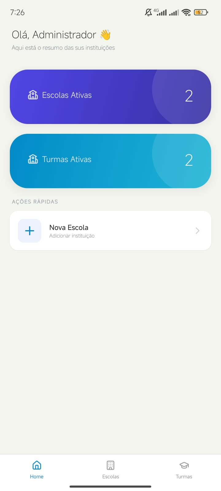
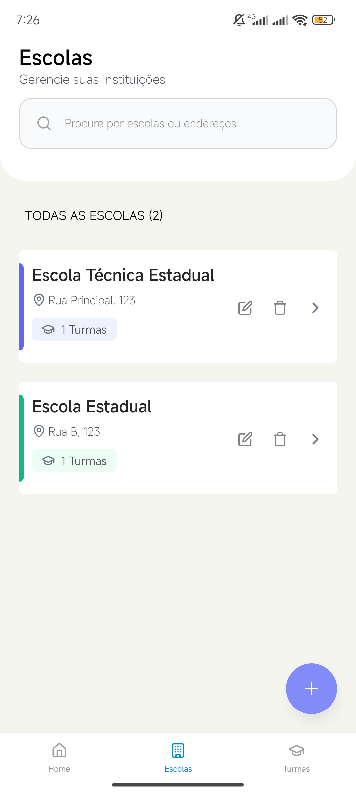
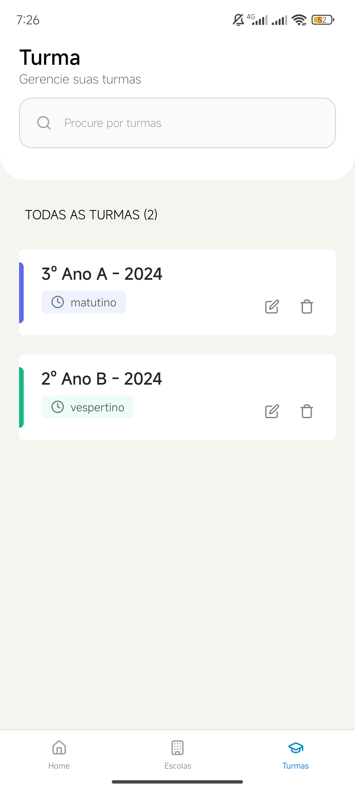
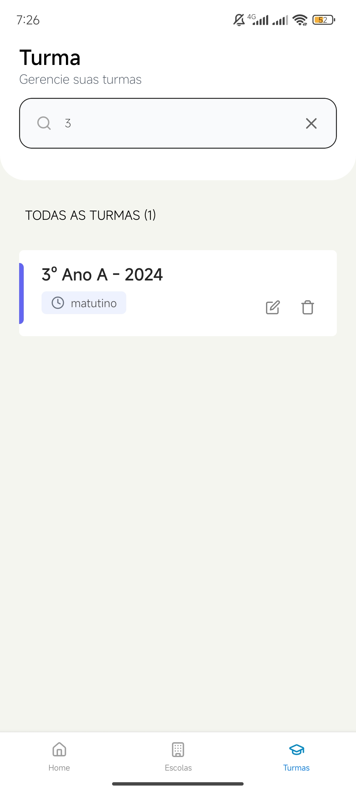
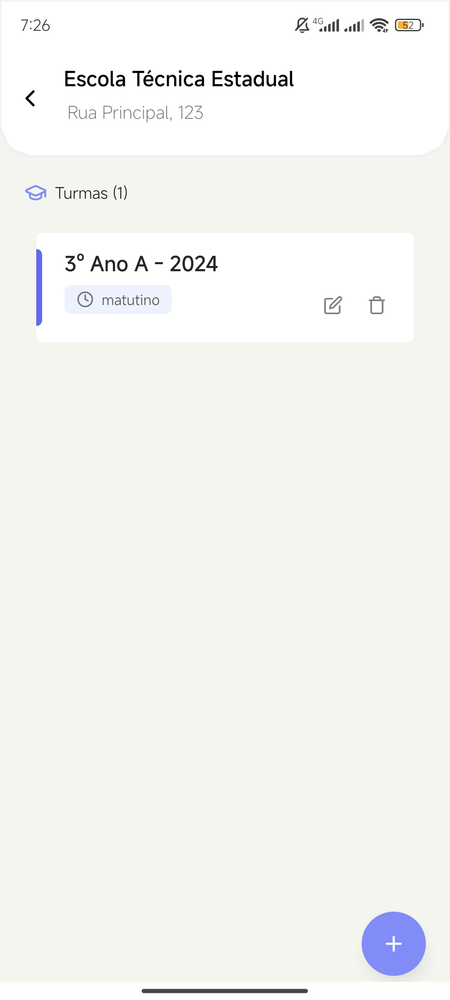
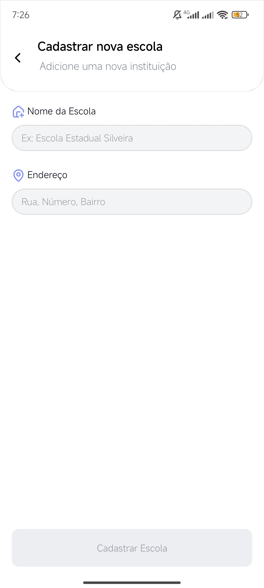
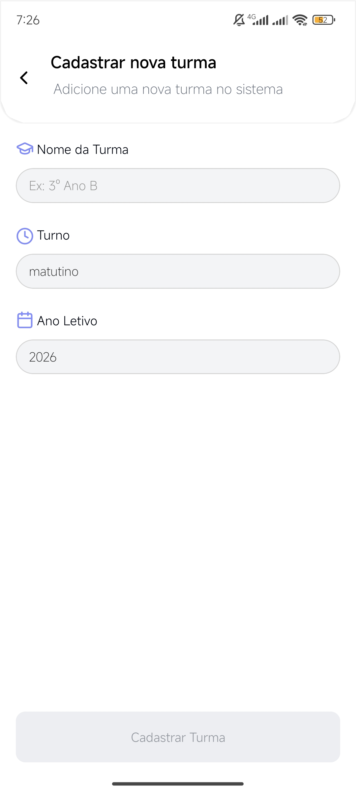
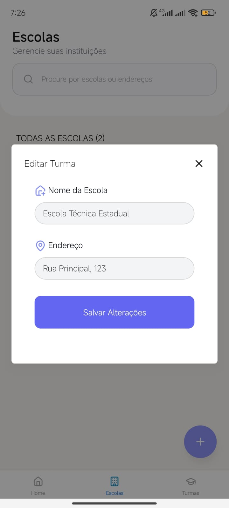
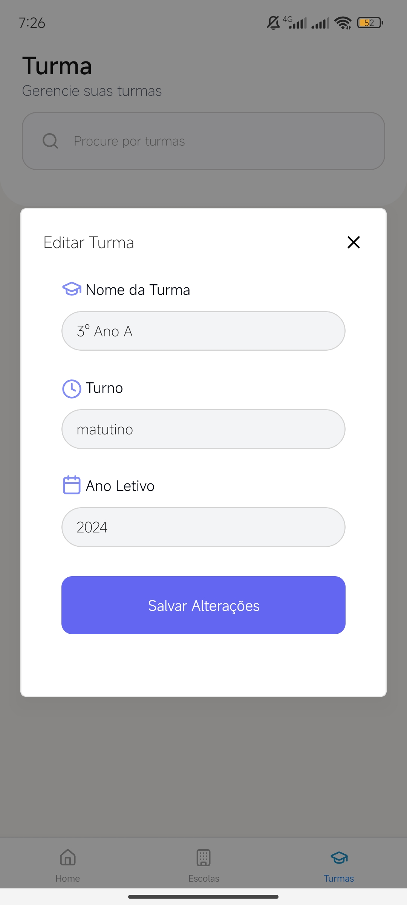
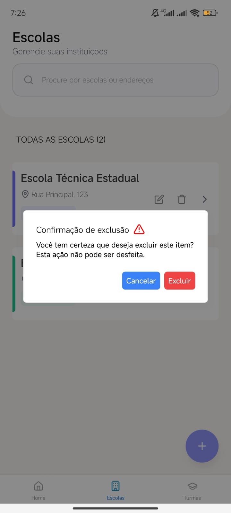

# 🏫 Gerenciador de Escolas e Turmas

Um aplicativo mobile para gerenciamento de escolas públicas, permitindo o cadastro de escolas e suas respectivas turmas.

## 🚀 Tecnologias e Versões

O projeto foi construído utilizando as versões mais estáveis das seguintes tecnologias:

    Node.js: v22.x

    Expo: ~54.0.33 (SDK)

    Expo Router: ~6.0.23 (Navegação)

    React: 19.1.0

    React Native: 0.81.5

    Zustand: ^5.0.12 (Gerenciamento de Estado)

    NativeWind: ^4.2.3 (Estilização com Tailwind CSS)

    MirageJS: ^0.1.48 (Mock de API)

    Lucide React Native: ^1.8.0 (Ícones)

    Moti: ^0.30.0 (Animações)

    Prettier: ^3.8.2 (Formatação)

    GLuestack ui: ^3.0.16 (UI)

## 📥 Instalação e Execução

Siga os passos abaixo para rodar o projeto localmente:

### 1. Clonar o repositório:

    Bash

    git clone https://github.com/Fernandadsantos/school-management.git
    cd school-management

### 2. Instalar as dependências:

    Bash

    npm install
    # ou
    yarn install

### 3. Caso necessário configure o Reanimated :

    Adicione 'react-native-reanimated/plugin' no seu babel.config.js.

### 4. Iniciar o Expo:

    Bash

    npx expo start
    # Pressione a para Android, i para iOS ou escaneie o QR Code com o app Expo Go.

## 🛠️ Mock de Back-end (MirageJS)

Este projeto utiliza o MirageJS para simular uma API REST em memória. Não é necessário configurar um banco de dados externo.

- Inicialização Automática: O servidor mock inicia junto com o aplicativo.

- Persistência: Os dados são voláteis (limpos ao reiniciar o app/cache).

- Relacionamentos: O sistema utiliza schoolId para vincular turmas à escolas específicas.

- Resetar Dados: Caso precise limpar o banco de dados do mock e rodar os seeds novamente:

      Bash

      # No terminal do Expo
      shift + r
      # OU
      npx expo start --clear

## 📱 Demonstração

### 📊 Visão Geral e Listagens

|                               Dashboard                               |                                      Lista de Escolas                                       |                                      Lista de Turmas                                      |
| :-------------------------------------------------------------------: | :-----------------------------------------------------------------------------------------: | :---------------------------------------------------------------------------------------: |
|  |  |  |

### Filtro de pesquisa

|                                      Pesquisa                                       |
| :---------------------------------------------------------------------------------: |
|  |

### ➕ Cadastro e Detalhes

|                                      Detalhes da Escola                                      |                                     Nova Escola                                      |                                     Nova Turma                                     |
| :------------------------------------------------------------------------------------------: | :----------------------------------------------------------------------------------: | :--------------------------------------------------------------------------------: |
|  |  |  |

### ✏️ Edição de Dados

|                                      Editar Escola                                      |                                     Editar Turma                                      |                               Deletar Escola ou Turma                               |
| :-------------------------------------------------------------------------------------: | :-----------------------------------------------------------------------------------: | :---------------------------------------------------------------------------------: |
|  |  |  |

## 📝 Funcionalidades Principais

- Dashboard: Contagem de ativos.

- Filtro em Tempo Real: Busca de turmas e escolas por nome ou endereço.

- Navegação Fluida: Utilização do Expo Router para rotas tipadas.

- Animações Suaves: Feedback visual ao carregar e transitar entre telas com Moti.

- Persistência com AsyncStorage.

✨ Desenvolvido por Fernanda Santos
